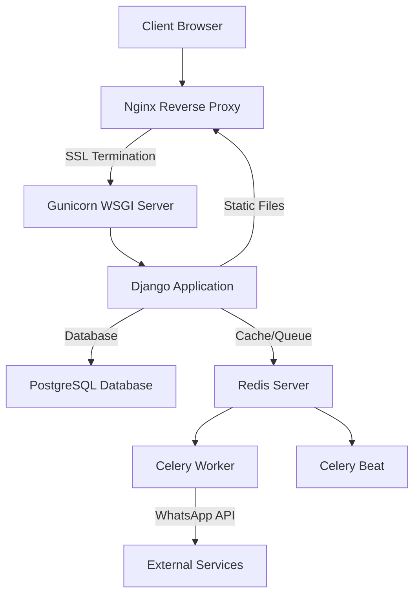
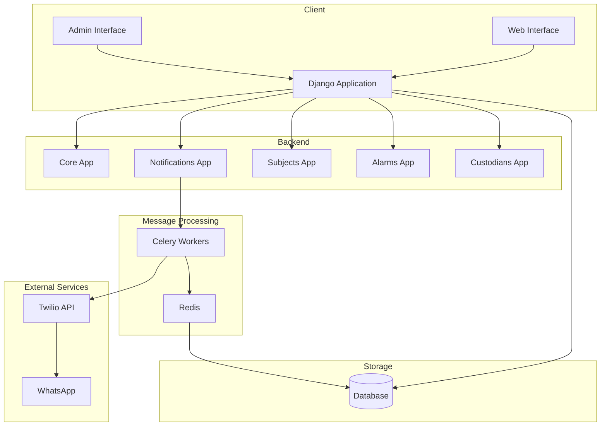
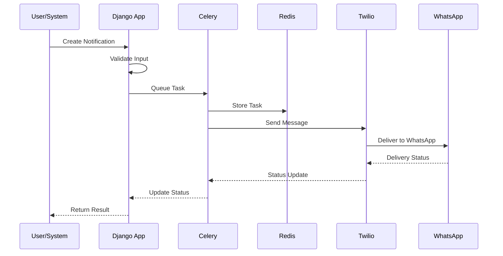
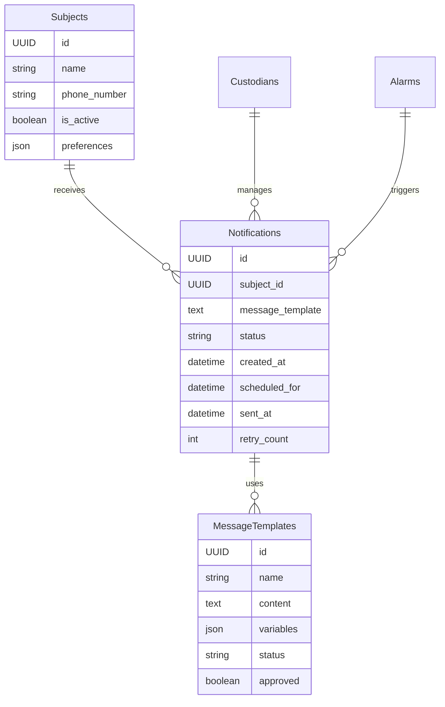
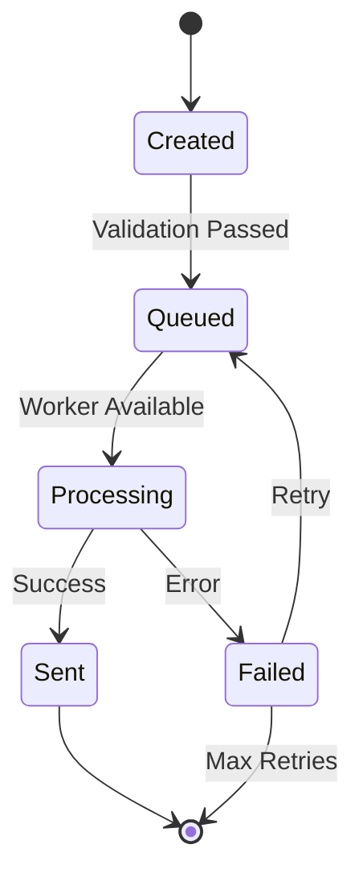
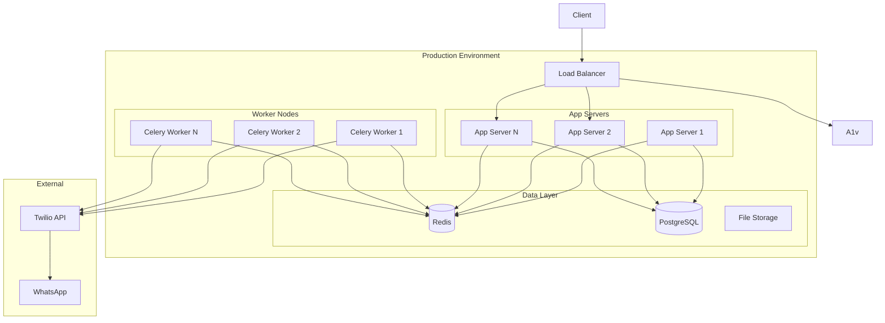
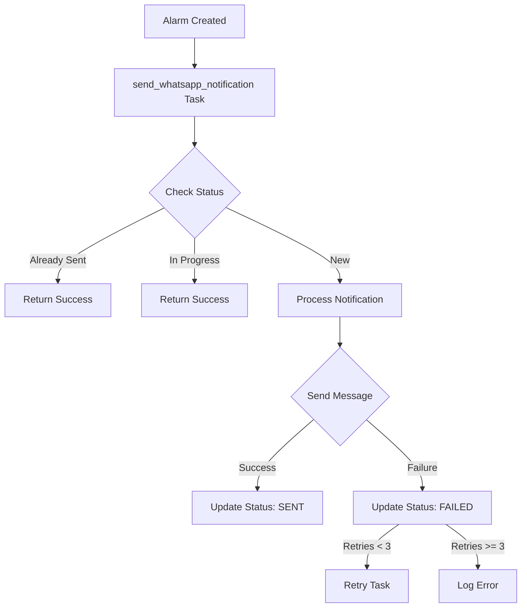
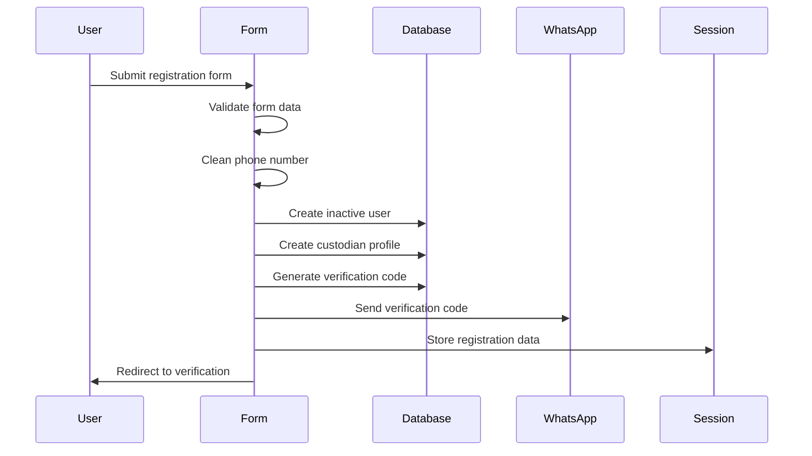
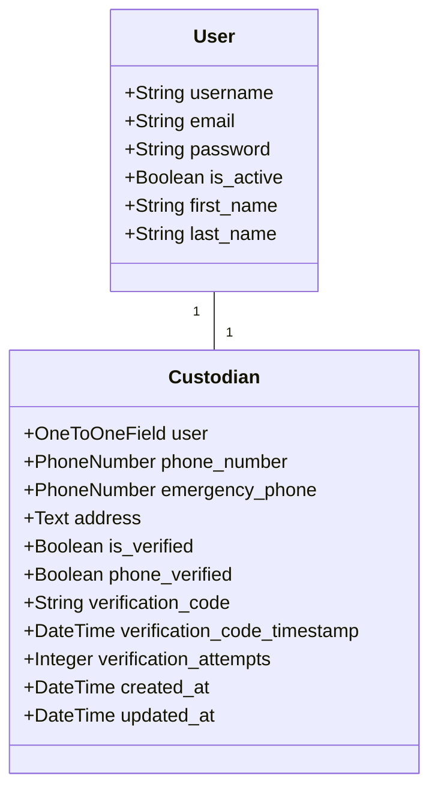

# Technical Specifications - Keryu System

## System Overview
The Keryu System is a Django-based application designed to manage subjects (such as children, elders, or persons with disabilities), generate QR codes for tracking, and deliver notifications through WhatsApp using the Meta WhatsApp Business API. The system handles user management with email verification, QR code generation, alarm creation, and asynchronous message delivery with robust race condition prevention and status tracking.

**Recent Fixes and Improvements:**
- Fixed buffer handling by resetting buffer position before saving images
- Improved error handling with try/except blocks and proper error responses
- Enhanced media handling using FileResponse and cache control headers
- Added frontend resilience with error handlers and placeholder images
- Implemented automatic retry mechanism with cache-busting
- Improved logging with additional debug information and size tracking
- Consolidated QR code generation with consistent parameters
- Fixed file system permissions for staticfiles directory

## Architecture Overview

### Production Stack


### Component Roles
1. **Nginx**
   - SSL/TLS termination with Let's Encrypt certificates
   - Static file serving
   - Reverse proxy to Gunicorn
   - HTTP/2 support
   - Caching and compression

2. **Gunicorn**
   - WSGI server
   - Multiple worker processes
   - Request handling
   - Process management

3. **Django**
   - Core application logic
   - URL routing
   - Template rendering
   - ORM and database interactions

4. **Redis**
   - Message broker for Celery
   - Result backend for Celery
   - Caching (optional)
   - Session storage (optional)

5. **Celery**
   - Asynchronous task processing
   - Scheduled tasks
   - Background job management
   - Message delivery

## Actors and Use Cases

### System Actors Overview

1. **Human Actors**
   ```mermaid
   graph TD
       A[System Users] --> B[Custodian]
       A --> C[System Administrator]
       A --> D[QR Code Scanner]
       A --> E[Doctor/Medical Professional]
       B --> F[Parent]
       B --> G[Guardian]
       B --> H[Caregiver]
   ```

2. **System Actors**
   ```mermaid
   graph TD
       A[System Components] --> B[WhatsApp Notification System]
       A --> C[Celery Worker]
       A --> D[Database System]
       A --> E[QR Code Generator]
       A --> F[Redis Server]
       A --> G[Celery Beat]
   ```

3. **Passive Actors**
   ```mermaid
   graph TD
       A[Monitored Entities] --> B[Subject]
       B --> C[Child]
       B --> D[Elder]
       B --> E[Person with Disability]
   ```

### Actor Use Cases

1. **Custodian Use Cases**
   - Subject Management
     * Register new subjects
     * Update subject information
     * View subject details
     * Manage medical information
   - QR Code Operations
     * Generate QR codes
     * Activate/deactivate codes
     * Test QR functionality
   - Alarm Monitoring
     * Receive notifications
     * View alarm history
     * Export reports
   - Account Management
     * Update profile
     * Manage preferences
     * Reset password

2. **System Administrator Use Cases**
   - User Management
     * Create/modify user accounts
     * Assign roles and permissions
     * Reset user passwords
   - System Configuration
     * Configure WhatsApp integration
     * Manage system settings
     * Monitor performance
   - Data Management
     * Backup management
     * Data cleanup
     * Export system data
   - Monitoring
     * View system logs
     * Monitor notifications
     * Track system health

3. **QR Code Scanner Use Cases**
   - Scan Operations
     * Scan QR codes
     * Receive scan confirmation
     * View scan error messages
   - Location Services
     * Provide location data
     * Confirm scan location
   - Emergency Response
     * Trigger alarms
     * Receive emergency instructions
     * View contact information

4. **Doctor/Medical Professional Use Cases**
   - Information Management
     * Provide medical information
     * Update emergency protocols
     * Maintain contact details
   - Emergency Response
     * Receive emergency notifications
     * Access patient information
     * Provide medical guidance

5. **WhatsApp Notification System Use Cases**
   - Message Handling
     * Process notification requests
     * Send messages
     * Track delivery status
   - Error Management
     * Handle delivery failures
     * Retry failed messages
     * Report status updates

6. **Celery Worker Use Cases**
   - Task Processing
     * Handle async operations
     * Process notification queue
     * Manage retries
   - System Tasks
     * Clean up old data
     * Generate reports
     * Process exports

7. **Database System Use Cases**
   - Data Operations
     * Store system data
     * Handle transactions
     * Maintain data integrity
   - Performance
     * Optimize queries
     * Handle concurrent access
     * Manage connections

8. **Subject (Passive Actor) Use Cases**
   - Profile Management
     * Have profile maintained
     * Have QR codes assigned
     * Have history tracked
   - Emergency Response
     * Have alarms triggered
     * Have notifications sent
     * Have location tracked

### Cross-Actor Workflows

1. **Emergency Response Flow**
   ```mermaid
   sequenceDiagram
       participant S as Scanner
       participant Sys as System
       participant W as WhatsApp
       participant C as Custodian
       participant D as Doctor
       
       S->>Sys: Scan QR Code
       Sys->>Sys: Validate & Create Alarm
       par Notification Flow
           Sys->>W: Send Alert
           W->>C: Deliver Message
       and Medical Response
           Sys->>D: Send Medical Alert
       end
       C->>Sys: View Alarm Details
       D->>Sys: Acknowledge Alert
   ```

2. **QR Code Lifecycle**
   ```mermaid
   sequenceDiagram
       participant C as Custodian
       participant A as Admin
       participant Sys as System
       participant S as Scanner
       
       C->>Sys: Request QR Code
       Sys->>A: Validate Request
       A->>Sys: Approve Generation
       Sys->>C: Deliver QR Code
       C->>Sys: Activate QR Code
       S->>Sys: Scan QR Code
       Sys->>C: Send Notification
   ```

### Performance and Security Requirements

1. **Response Time Requirements**
   | Actor | Operation | Max Time |
   |-------|-----------|-----------|
   | Custodian | Page Load | 2s |
   | Scanner | QR Scan | 3s |
   | WhatsApp | Message Delivery | 30s |
   | System | Report Generation | 5s |

2. **Security Requirements**
   | Actor | Requirement | Implementation |
   |-------|-------------|----------------|
   | Custodian | Authentication | Multi-factor |
   | Admin | Access Control | Role-based |
   | Scanner | Data Protection | Encryption |
   | System | Audit | Logging |

3. **Availability Requirements**
   | Component | Uptime Target |
   |-----------|---------------|
   | Web Interface | 99.9% |
   | WhatsApp | 99.99% |
   | Database | 99.999% |
   | QR System | 99.9% |

## Custodian Use Cases

### Primary Actors
- Custodian (parent, guardian, or caregiver)
- System Administrator
- WhatsApp Notification System

### Preconditions
- Custodian has a registered account
- Custodian has provided a valid WhatsApp number
- System is properly configured for WhatsApp notifications

### Main Use Cases

1. **Subject Management**
   - Register new subjects (children, elders, etc.)
   - Update subject information
   - View subject details and history
   - Upload and manage subject photos
   - Add/update medical information
   - Manage doctor's information

2. **QR Code Management**
   - Generate QR codes for subjects
   - Activate/deactivate QR codes
   - Download QR code images
   - Test QR code functionality
     * Direct URL access for testing
     * Browser-based QR simulation
     * Complete notification flow testing
   - View QR code usage history
   - Print QR codes for physical use

3. **Alarm Monitoring**
   - Receive real-time WhatsApp notifications
   - View alarm history
   - Access alarm details (time, location)
   - Export alarm reports
   - Review notification status

4. **Account Management**
   - Update profile information
   - Change WhatsApp notification number
   - Manage notification preferences
   - View activity logs
   - Reset password

### Workflow Scenarios

1. **Subject Registration**
   ```mermaid
   sequenceDiagram
       participant C as Custodian
       participant S as System
       participant D as Database
       
       C->>S: Access registration form
       S->>C: Display form
       C->>S: Submit subject details
       S->>S: Validate information
       S->>D: Store subject data
       S->>C: Confirm registration
   ```

2. **QR Code Generation**
   ```mermaid
   sequenceDiagram
       participant C as Custodian
       participant S as System
       participant Q as QR Generator
       
       C->>S: Request new QR code
       S->>S: Validate subject status
       S->>Q: Generate unique QR code
       Q->>S: Return QR image
       S->>C: Deliver QR code
   ```

3. **Alarm Response**
   ```mermaid
   sequenceDiagram
       participant QR as QR Code
       participant S as System
       participant W as WhatsApp
       participant C as Custodian
       
       QR->>S: QR code scanned
       S->>S: Create alarm
       S->>W: Send notification
       W->>C: Deliver message
       C->>S: View alarm details
   ```

### Exception Scenarios

1. **QR Code Issues**
   - QR code is inactive
   - Invalid QR code scan
   - Multiple rapid scans
   - System response:
     - Error message to scanner
     - Notification to custodian
     - Log incident

2. **Notification Failures**
   - WhatsApp delivery failure
   - Invalid phone number
   - Network issues
   - System response:
     - Retry mechanism
     - Alternative notification
     - Error logging
     - Status tracking

3. **Access Control**
   - Invalid credentials
   - Expired sessions
   - Unauthorized access attempts
   - System response:
     - Security alerts
     - Account locking
     - Audit logging

### Performance Requirements

1. **Response Times**
   - QR code generation: < 3 seconds
   - Notification delivery: < 30 seconds
   - Page load times: < 2 seconds
   - Report generation: < 5 seconds

2. **Availability**
   - System uptime: 99.9%
   - Notification service: 99.99%
   - Backup availability: 99.999%

3. **Concurrency**
   - Multiple simultaneous logins
   - Parallel QR code processing
   - Bulk notification handling

### Security Considerations

1. **Data Protection**
   - Subject information encryption
   - Secure QR code generation
   - Private data masking
   - Access logging

2. **Authentication**
   - Multi-factor authentication option
   - Session management
   - Password policies
   - Account recovery process

3. **Authorization**
   - Role-based access control
   - Feature-based permissions
   - Data access restrictions
   - Audit trailing

## Technology Stack

### Backend Framework
- Django 5.0+
- Python 3.11+
- Celery for asynchronous task processing
- Redis as message broker and result backend

### Database
- PostgreSQL (both Development and Production)

### External Services
- Meta WhatsApp Business Platform API
- QR Code generation library

### Authentication & Security
- Django's built-in authentication system
- Environment-based configuration (.env)
- CSRF protection
- Permission-based access control

## System Architecture

### Core Components

1. **Django Applications**
   - `core/`: Core system functionality and settings
   - `custodians/`: User and permission management
   - `subjects/`: Subject management and QR code handling
   - `alarms/`: Alarm processing and notification triggers
   - `notifications/`: WhatsApp notification delivery

2. **Asynchronous Processing**
   - Celery worker processes
   - Redis message broker
   - Task scheduling and retry mechanisms

3. **WhatsApp Integration**
   - Meta WhatsApp Business API client
   - Message template management
   - Error handling and retry logic
   - Delivery status tracking

### Process Management

The system relies on several concurrent processes that work together:

1. **Redis Server**
   - Acts as message broker for Celery
   - Provides result backend storage
   - Single instance required

2. **Celery Worker**
   - Handles asynchronous tasks
   - Processes multiple queues:
     * subjects: Subject-related tasks
     * alarms: Alarm processing tasks
     * default: General tasks
   - Single worker instance with solo pool

3. **Celery Beat**
   - Manages scheduled tasks
   - Runs periodic task scheduling
   - Single instance required

4. **Django Development Server**
   - Runs with two processes by design:
     * Main process: Handles HTTP requests
     * Autoreloader: Watches for file changes
   - Both processes are normal and expected

### Process Management Tools

1. **Startup Script (`startup.sh`)**
   - Manages service lifecycle
   - Features:
     * Process cleanup
     * Conda environment activation
     * Service startup sequence
     * Health checks
     * Instance verification
   - Ensures single instances (except Django)
   - Provides proper error handling

2. **Process Verification**
   - Checks running instances
   - Validates process counts
   - Ensures clean environment

3. **Service Dependencies**
   ```mermaid
   graph TD
       A[Redis Server] --> B[Celery Worker]
       A --> C[Celery Beat]
       B --> D[Django Server]
       C --> D
   ```

## System Diagrams

### High-Level System Architecture


### Notification Flow Sequence


### Database Entity Relationship


### Component State Flow


### Deployment Architecture


## Database Schema

### Key Tables

1. **Subjects**
   ```sql
   CREATE TABLE subjects_subject (
       id SERIAL PRIMARY KEY,
       name VARCHAR(100) NOT NULL,
       date_of_birth DATE NOT NULL,
       gender VARCHAR(1) NOT NULL,
       medical_conditions TEXT,
       allergies TEXT,
       medications TEXT,
       custodian_id INTEGER REFERENCES custodians_custodian(id),
       doctor_name VARCHAR(100),
       doctor_phone VARCHAR(128),
       doctor_address TEXT,
       doctor_speciality VARCHAR(100),
       created_at TIMESTAMP WITH TIME ZONE,
       updated_at TIMESTAMP WITH TIME ZONE,
       photo VARCHAR(100),
       is_active BOOLEAN DEFAULT TRUE
   );
   ```

2. **QR Codes**
   ```sql
   CREATE TABLE subjects_subjectqr (
       id SERIAL PRIMARY KEY,
       subject_id INTEGER REFERENCES subjects_subject(id),
       uuid UUID NOT NULL UNIQUE,
       created_at TIMESTAMP WITH TIME ZONE,
       activated_at TIMESTAMP WITH TIME ZONE,
       last_used TIMESTAMP WITH TIME ZONE,
       is_active BOOLEAN DEFAULT FALSE,
       image VARCHAR(100)
   );
   ```

3. **Alarms**
   ```sql
   CREATE TABLE subjects_alarm (
       id SERIAL PRIMARY KEY,
       subject_id INTEGER REFERENCES subjects_subject(id),
       qr_code_id INTEGER REFERENCES subjects_subjectqr(id),
       timestamp TIMESTAMP WITH TIME ZONE,
       location VARCHAR(100),
       notification_sent BOOLEAN DEFAULT FALSE,
       notification_error TEXT,
       notification_attempts INTEGER DEFAULT 0,
       last_attempt TIMESTAMP WITH TIME ZONE,
       whatsapp_message_id VARCHAR(255),
       notification_status VARCHAR(20) DEFAULT 'PENDING'
   );
   ```

## API Endpoints

### QR Code Management
```
GET /subjects/qr/<uuid>/scan/     # Handle QR code scanning
POST /subjects/qr/generate/       # Generate new QR code
POST /subjects/qr/<uuid>/activate/    # Activate QR code
POST /subjects/qr/<uuid>/deactivate/  # Deactivate QR code
GET /subjects/qr/<uuid>/download/     # Download QR code image
POST /subjects/qr/<uuid>/trigger/     # Test QR code alarm
```

### Subject Management
```
GET /subjects/list/               # List subjects
POST /subjects/create/           # Create new subject
GET /subjects/<id>/edit/         # Edit subject
POST /subjects/<id>/update/      # Update subject
POST /subjects/<id>/delete/      # Delete subject
```

### Alarm Management
```
GET /alarms/list/                # List alarms
GET /alarms/<id>/details/        # View alarm details
GET /alarms/statistics/data/     # Get alarm statistics
GET /alarms/export/csv/          # Export alarms as CSV
GET /alarms/export/excel/        # Export alarms as Excel
GET /alarms/export/pdf/          # Export alarms as PDF
POST /alarms/<id>/retry/         # Retry failed notification
```

## Test Alarm Functionality

### Test Alarm Flow
1. User clicks "Test Alarm" button for a QR code
2. System verifies QR code is active
3. Creates alarm with notification_status='TEST'
4. Sends WhatsApp notification with test indicator
5. Returns success/failure response

### Test Response Handling
- Browser requests: HTML response with Bootstrap styling
- API requests: JSON response with status and message
- Inactive QR codes: Error response with appropriate message

### Testing Requirements
- Unit test coverage: >80%
- Integration tests for all API endpoints
- End-to-end testing with pytest
- Performance testing
- Test environment configuration
- Automated test suite in CI/CD pipeline

### Test Categories
1. **API Tests**
   - Subject management
   - QR code operations
   - Alarm handling
   - Export functionality
   - Authentication

2. **Integration Tests**
   - WhatsApp notification flow
   - QR code generation
   - Alarm creation and updates
   - Export file generation

3. **Unit Tests**
   - Model validations
   - Form processing
   - Utility functions
   - Helper methods

4. **Security Tests**
   - Authentication checks
   - Permission validation
   - Input sanitization
   - CSRF protection

## WhatsApp Integration

### Message Template
```json
{
    "name": "qr_template_on_m",
    "language": {
        "code": "en_US"
    },
    "components": [
        {
            "type": "body",
            "parameters": [
                {
                    "type": "text",
                    "text": "{{subject_name}}"
                },
                {
                    "type": "text",
                    "text": "{{timestamp}}"
                }
            ]
        }
    ]
}
```

### Notification Flow
1. QR code is scanned
2. Alarm is created
3. WhatsApp notification task is queued
4. Task is processed by Celery worker
5. Message is sent via WhatsApp API
6. Delivery status is updated in database

## Error Handling

### Notification Retry Logic
- Maximum 3 retry attempts
- Exponential backoff (60 seconds)
- Error tracking in database
- Detailed logging

### Status Tracking
```python
NOTIFICATION_STATUSES = [
    ('PENDING', 'Pending'),
    ('PROCESSING', 'Processing'),
    ('SENT', 'Sent'),
    ('DELIVERED', 'Delivered'),
    ('FAILED', 'Failed'),
    ('ERROR', 'Error'),
]
```

## Security Measures

1. **Authentication**
   - JWT-based API authentication
   - Session-based admin authentication
   - Role-based access control

2. **Data Protection**
   - Encrypted environment variables
   - Phone number hashing
   - Secure message storage

3. **API Security**
   - Rate limiting
   - CORS configuration
   - Input validation

## Monitoring and Logging

### Log Categories
1. **System Logs**
   - Application errors
   - Performance metrics
   - Security events

2. **Notification Logs**
   - Delivery status
   - Failed attempts
   - Rate limit hits

3. **User Activity Logs**
   - Admin actions
   - API usage
   - Template modifications

## Performance Specifications

### System Requirements
- CPU: 2+ cores
- RAM: 4GB minimum
- Storage: 20GB minimum
- Network: 100Mbps minimum

### Capacity
- Concurrent users: 100+
- Messages per minute: 500+
- Response time: < 200ms

### Scalability
- Horizontal scaling support
- Load balancer ready
- Containerization support

## Deployment Requirements

### Environment Variables
```
DJANGO_SECRET_KEY
TWILIO_ACCOUNT_SID
TWILIO_AUTH_TOKEN
TWILIO_PHONE_NUMBER
REDIS_URL
DATABASE_URL
DEBUG
ALLOWED_HOSTS
```

### Dependencies
- See requirements.txt for full list
- Core dependencies:
  - Django
  - Celery
  - Redis
  - Twilio SDK
  - psycopg2-binary
  - python-dotenv

## Backup and Recovery

### Backup Strategy
1. Database backups: Daily
2. File system backups: Weekly
3. Configuration backups: On change

### Recovery Procedures
1. Database restoration process
2. System state recovery
3. Configuration restoration

## Development Guidelines

### Code Standards
- PEP 8 compliance
- Django best practices
- Type hinting
- Docstring requirements

### Testing Requirements
- Unit test coverage: >80%
- Integration tests
- End-to-end testing
- Performance testing

### Version Control
- Git-based
- Feature branch workflow
- Semantic versioning
- Code review requirements

## Documentation Requirements

### Required Documentation
1. API documentation
2. Setup guides
3. User manuals
4. Admin guides
5. Troubleshooting guides

### Maintenance
- Regular updates
- Version tracking
- Change logs
- Update procedures

## Authentication and Security

### Email Verification System
1. **Registration Flow**
   - User submits registration form
   - Account created in inactive state
   - Verification email sent with secure token
   - Account activated upon verification
   - Development mode supports instant verification

2. **Token Generation**
   - Secure token generation using Django's TokenGenerator
   - Token includes user ID and timestamp
   - 24-hour expiration period
   - One-time use only

3. **Verification Process**
   - Token validation on verification attempt
   - Automatic account activation
   - Redirect to login upon success
   - Error handling for invalid/expired tokens

### Dashboard Security
1. **Access Control**
   - Role-based access (Admin/Custodian)
   - Staff users excluded from custodian counts
   - Filtered data based on user role
   - Secure statistical calculations

## Notification System Architecture

### Task Architecture


### Status Tracking
The system uses a comprehensive status tracking system:
```python
notification_status = models.CharField(
    max_length=20,
    choices=[
        ('PENDING', 'Pending'),
        ('PROCESSING', 'Processing'),
        ('SENT', 'Sent'),
        ('DELIVERED', 'Delivered'),
        ('FAILED', 'Failed'),
        ('ERROR', 'Error'),
    ],
    default='PENDING'
)
```

### Race Condition Prevention
- Database-level locking using `select_for_update`
- Transaction isolation
- Status-based duplicate prevention
- Atomic updates for notification fields

### Retry Mechanism
- Maximum 3 retry attempts
- Exponential backoff
- Detailed error tracking
- Status preservation between attempts 

### QR Code Management

QR codes in the system can be managed through a user-friendly interface that provides the following functionality:

1. **QR Code Status Toggle**
   - Each QR code has an active/inactive status that can be toggled directly from the QR code list view
   - The toggle is implemented as a clickable badge that updates in real-time using AJAX
   - Only one QR code can be active per subject at a time
   - Visual indicators include:
     - Green badge for active status
     - Red badge for inactive status
     - Opacity changes for the QR code image
     - Border color changes for the card

2. **QR Code Generation**

## Custodian Registration System

### Registration Flow


### Form Fields and Validation
1. **Required Fields**
   - First name (required)
   - Last name (required)
   - Email (required, unique)
   - Password (with Django's validation rules)
   - Phone number (Mexican format)

2. **Phone Number Format**
   - Accepts Mexican phone numbers:
     * 10 digits (automatically adds +52)
     * 12 digits starting with 52
     * 13 digits starting with 521
   - Validates using PhoneNumberField with Mexico region
   - Formats all numbers to international format

3. **Password Requirements**
   - Minimum 8 characters
   - Cannot be similar to personal information
   - Cannot be a commonly used password
   - Cannot be entirely numeric
   - Must include a mix of characters

### Security Features
1. **Form Security**
   - CSRF protection
   - Session-based verification flow
   - Transaction atomic operations
   - Input validation and sanitization

2. **Verification Process**
   - Two-step verification:
     * Email verification (user remains inactive)
     * Phone verification via WhatsApp
   - 4-digit verification code
   - 15-minute code expiration
   - Verification attempt tracking
   - Session-based state management

3. **Error Handling**
   - Duplicate email detection
   - Duplicate phone number detection
   - Invalid phone format handling
   - Session expiration handling
   - WhatsApp delivery failure handling
   - Transaction rollback on failures

### Data Model


### WhatsApp Integration
1. **Message Service**
   - Primary: Meta WhatsApp Business API
   - Fallback: Twilio WhatsApp
   - Message template for verification
   - Delivery status tracking

2. **Verification Code**
   - 4-digit numeric code
   - Rate limiting on resend
   - Attempt tracking
   - Automatic expiration

### Session Management
1. **Registration Session**
   - Stores pending registration data
   - 15-minute expiration
   - Secure cookie handling
   - Clean-up on completion/failure

2. **State Tracking**
   - Registration progress
   - Verification status
   - Error states
   - Completion status

### Error States and Recovery
1. **Registration Failures**
   - Duplicate email/phone
   - Invalid input data
   - WhatsApp delivery failure
   - Session expiration

2. **Recovery Mechanisms**
   - Automatic cleanup of failed registrations
   - Resend verification option
   - Session recovery
   - Error-specific guidance