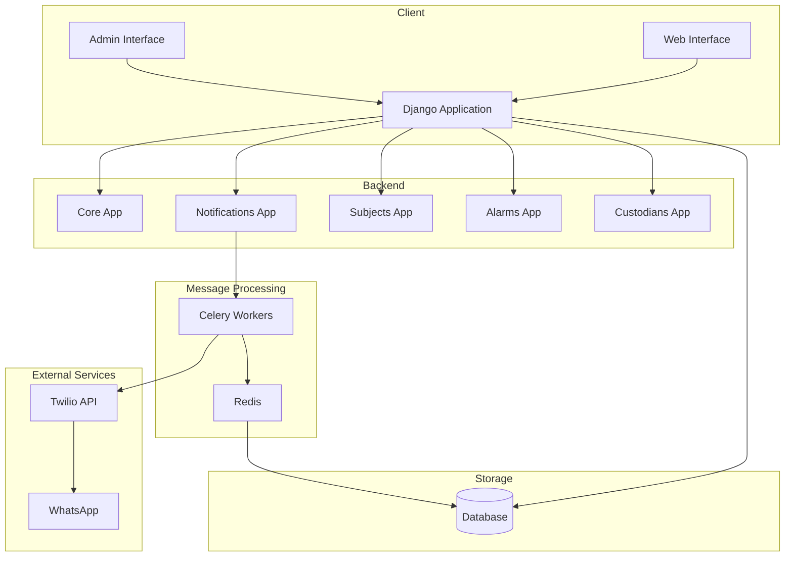
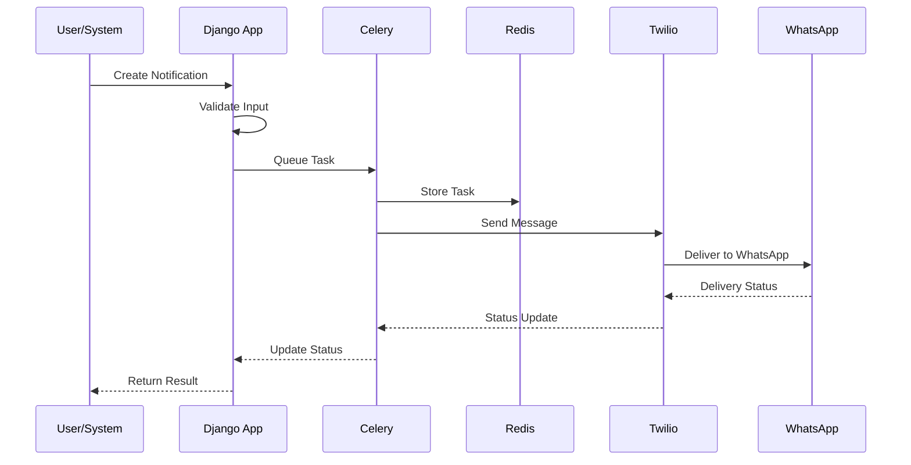
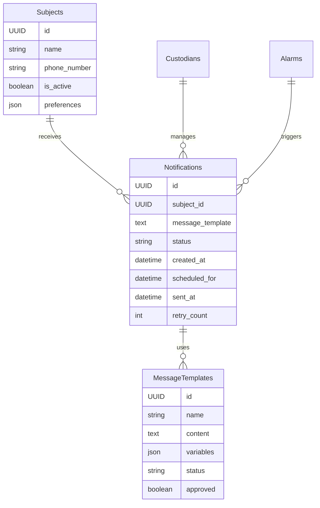
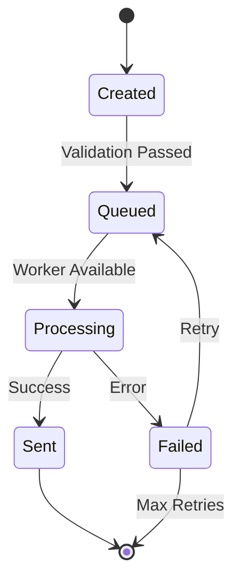
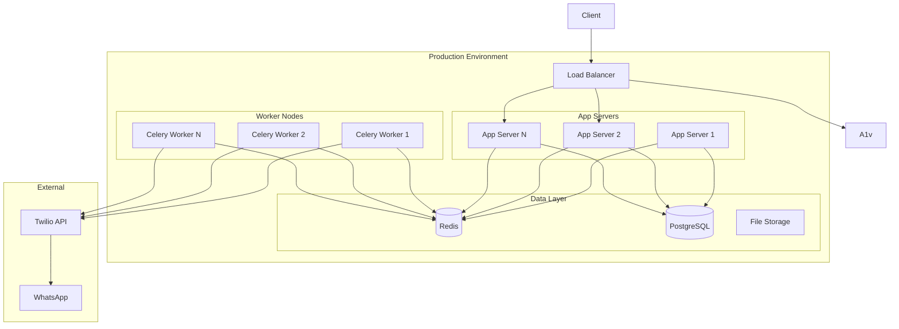

# Technical Specifications - Keryu Notification System

## System Overview
The Keryu Notification System is a Django-based application designed to manage and deliver notifications through WhatsApp using the Twilio API. The system handles user management, notification scheduling, and asynchronous message delivery.

## Technology Stack

### Backend Framework
- Django 4.x
- Python 3.8+
- Celery for asynchronous task processing
- Redis as message broker and result backend

### Database
- SQLite (Development)
- PostgreSQL (Recommended for Production)

### External Services
- Twilio WhatsApp Business API
- Meta WhatsApp Business Platform (for templates)

### Authentication & Security
- Django's built-in authentication system
- Environment-based configuration (.env)
- Token-based API authentication

## System Architecture

### Core Components

1. **Django Applications**
   - `core/`: Core system functionality and settings
   - `notifications/`: Notification management and delivery
   - `subjects/`: Subject/recipient management
   - `alarms/`: Alarm and trigger management
   - `custodians/`: User and permission management

2. **Asynchronous Processing**
   - Celery worker processes
   - Redis message broker
   - Task scheduling and retry mechanisms

3. **WhatsApp Integration**
   - Twilio client implementation
   - Message template management
   - Rate limiting handling
   - Error logging and monitoring

## System Diagrams

### High-Level System Architecture


### Notification Flow Sequence


### Database Entity Relationship


### Component State Flow


### Deployment Architecture


## Database Schema

### Key Tables

1. **Notifications**
   ```sql
   - id (UUID)
   - subject_id (FK)
   - message_template (Text)
   - status (CharField)
   - created_at (DateTime)
   - scheduled_for (DateTime)
   - sent_at (DateTime)
   - retry_count (Integer)
   ```

2. **Subjects**
   ```sql
   - id (UUID)
   - name (CharField)
   - phone_number (CharField)
   - is_active (Boolean)
   - preferences (JSONField)
   ```

3. **MessageTemplates**
   ```sql
   - id (UUID)
   - name (CharField)
   - content (TextField)
   - variables (JSONField)
   - status (CharField)
   - approved (Boolean)
   ```

## API Endpoints

### Notification Management
```
POST /api/notifications/create/
GET /api/notifications/list/
GET /api/notifications/<id>/status/
POST /api/notifications/<id>/retry/
```

### Subject Management
```
POST /api/subjects/create/
GET /api/subjects/list/
PUT /api/subjects/<id>/update/
DELETE /api/subjects/<id>/delete/
```

## WhatsApp Integration

### Message Templates
- Template Name: `notification_alert`
- Variables: 
  - {{1}} : Subject Name
  - {{2}} : Alert Type
  - {{3}} : Message Content
  - {{4}} : Action Required

### Rate Limiting
- Sandbox: 1 message per second
- Production: Based on WhatsApp Business API limits

## Security Measures

1. **Authentication**
   - JWT-based API authentication
   - Session-based admin authentication
   - Role-based access control

2. **Data Protection**
   - Encrypted environment variables
   - Phone number hashing
   - Secure message storage

3. **API Security**
   - Rate limiting
   - CORS configuration
   - Input validation

## Monitoring and Logging

### Log Categories
1. **System Logs**
   - Application errors
   - Performance metrics
   - Security events

2. **Notification Logs**
   - Delivery status
   - Failed attempts
   - Rate limit hits

3. **User Activity Logs**
   - Admin actions
   - API usage
   - Template modifications

## Performance Specifications

### System Requirements
- CPU: 2+ cores
- RAM: 4GB minimum
- Storage: 20GB minimum
- Network: 100Mbps minimum

### Capacity
- Concurrent users: 100+
- Messages per minute: 500+
- Response time: < 200ms

### Scalability
- Horizontal scaling support
- Load balancer ready
- Containerization support

## Deployment Requirements

### Environment Variables
```
DJANGO_SECRET_KEY
TWILIO_ACCOUNT_SID
TWILIO_AUTH_TOKEN
TWILIO_PHONE_NUMBER
REDIS_URL
DATABASE_URL
DEBUG
ALLOWED_HOSTS
```

### Dependencies
- See requirements.txt for full list
- Core dependencies:
  - Django
  - Celery
  - Redis
  - Twilio SDK
  - psycopg2-binary
  - python-dotenv

## Backup and Recovery

### Backup Strategy
1. Database backups: Daily
2. File system backups: Weekly
3. Configuration backups: On change

### Recovery Procedures
1. Database restoration process
2. System state recovery
3. Configuration restoration

## Development Guidelines

### Code Standards
- PEP 8 compliance
- Django best practices
- Type hinting
- Docstring requirements

### Testing Requirements
- Unit test coverage: >80%
- Integration tests
- End-to-end testing
- Performance testing

### Version Control
- Git-based
- Feature branch workflow
- Semantic versioning
- Code review requirements

## Documentation Requirements

### Required Documentation
1. API documentation
2. Setup guides
3. User manuals
4. Admin guides
5. Troubleshooting guides

### Maintenance
- Regular updates
- Version tracking
- Change logs
- Update procedures 