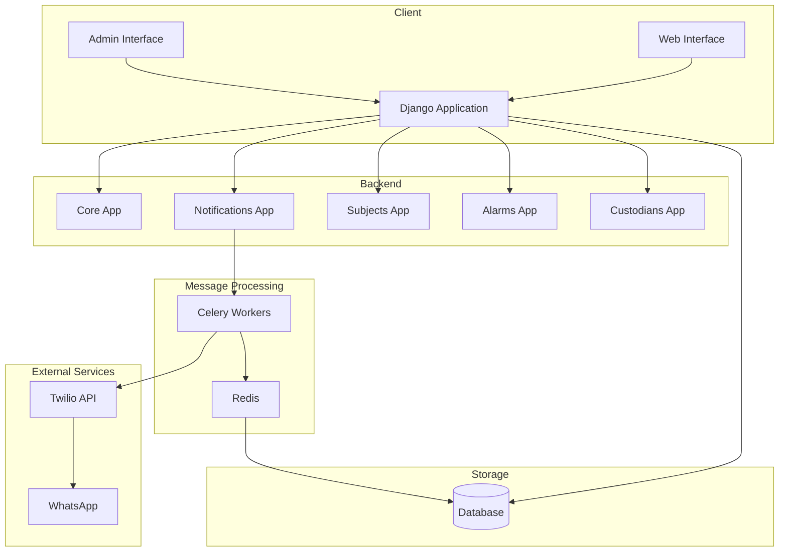
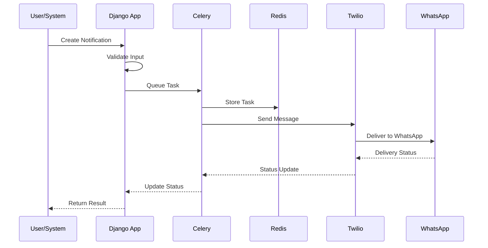
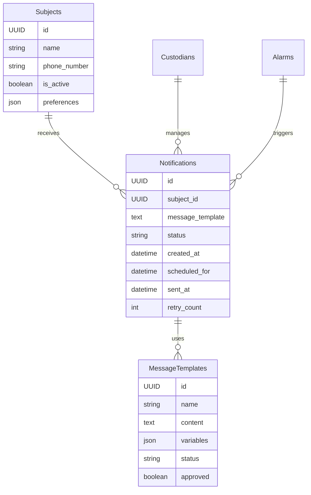
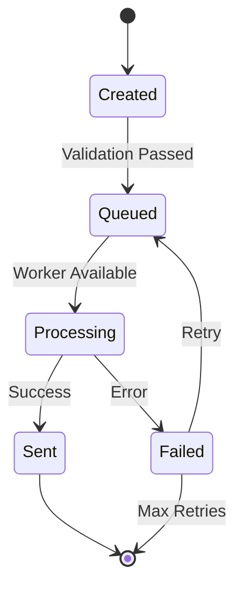
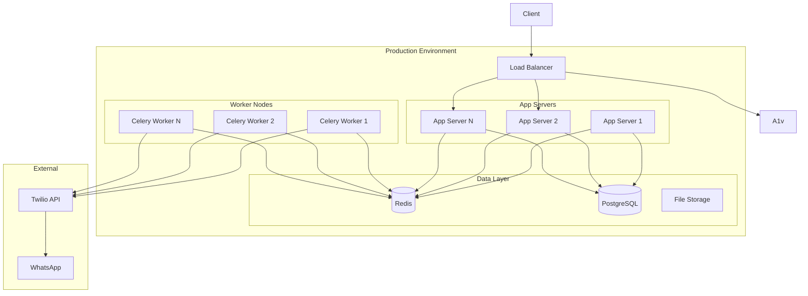

# Technical Specifications - Keryu System

## System Overview
The Keryu System is a Django-based application designed to manage subjects (such as children, elders, or persons with disabilities), generate QR codes for tracking, and deliver notifications through WhatsApp using the Meta WhatsApp Business API. The system handles user management, QR code generation, alarm creation, and asynchronous message delivery.

## Technology Stack

### Backend Framework
- Django 5.0+
- Python 3.11+
- Celery for asynchronous task processing
- Redis as message broker and result backend

### Database
- PostgreSQL (both Development and Production)

### External Services
- Meta WhatsApp Business Platform API
- QR Code generation library

### Authentication & Security
- Django's built-in authentication system
- Environment-based configuration (.env)
- CSRF protection
- Permission-based access control

## System Architecture

### Core Components

1. **Django Applications**
   - `core/`: Core system functionality and settings
   - `custodians/`: User and permission management
   - `subjects/`: Subject management and QR code handling
   - `alarms/`: Alarm processing and notification triggers
   - `notifications/`: WhatsApp notification delivery

2. **Asynchronous Processing**
   - Celery worker processes
   - Redis message broker
   - Task scheduling and retry mechanisms

3. **WhatsApp Integration**
   - Meta WhatsApp Business API client
   - Message template management
   - Error handling and retry logic
   - Delivery status tracking

## System Diagrams

### High-Level System Architecture


### Notification Flow Sequence


### Database Entity Relationship


### Component State Flow


### Deployment Architecture


## Database Schema

### Key Tables

1. **Subjects**
   ```sql
   CREATE TABLE subjects_subject (
       id SERIAL PRIMARY KEY,
       name VARCHAR(100) NOT NULL,
       date_of_birth DATE NOT NULL,
       gender VARCHAR(1) NOT NULL,
       medical_conditions TEXT,
       allergies TEXT,
       medications TEXT,
       custodian_id INTEGER REFERENCES custodians_custodian(id),
       doctor_name VARCHAR(100),
       doctor_phone VARCHAR(128),
       doctor_address TEXT,
       doctor_speciality VARCHAR(100),
       created_at TIMESTAMP WITH TIME ZONE,
       updated_at TIMESTAMP WITH TIME ZONE,
       photo VARCHAR(100),
       is_active BOOLEAN DEFAULT TRUE
   );
   ```

2. **QR Codes**
   ```sql
   CREATE TABLE subjects_subjectqr (
       id SERIAL PRIMARY KEY,
       subject_id INTEGER REFERENCES subjects_subject(id),
       uuid UUID NOT NULL UNIQUE,
       created_at TIMESTAMP WITH TIME ZONE,
       activated_at TIMESTAMP WITH TIME ZONE,
       last_used TIMESTAMP WITH TIME ZONE,
       is_active BOOLEAN DEFAULT FALSE,
       image VARCHAR(100)
   );
   ```

3. **Alarms**
   ```sql
   CREATE TABLE subjects_alarm (
       id SERIAL PRIMARY KEY,
       subject_id INTEGER REFERENCES subjects_subject(id),
       qr_code_id INTEGER REFERENCES subjects_subjectqr(id),
       timestamp TIMESTAMP WITH TIME ZONE,
       location VARCHAR(100),
       notification_sent BOOLEAN DEFAULT FALSE,
       notification_error TEXT,
       notification_attempts INTEGER DEFAULT 0,
       last_attempt TIMESTAMP WITH TIME ZONE,
       whatsapp_message_id VARCHAR(255),
       notification_status VARCHAR(20) DEFAULT 'PENDING'
   );
   ```

## API Endpoints

### QR Code Management
```
GET /subjects/qr/<uuid>/scan/     # Handle QR code scanning
POST /subjects/qr/generate/       # Generate new QR code
POST /subjects/qr/<uuid>/activate/    # Activate QR code
POST /subjects/qr/<uuid>/deactivate/  # Deactivate QR code
GET /subjects/qr/<uuid>/download/     # Download QR code image
```

### Subject Management
```
GET /subjects/list/               # List subjects
POST /subjects/create/           # Create new subject
GET /subjects/<id>/edit/         # Edit subject
POST /subjects/<id>/update/      # Update subject
POST /subjects/<id>/delete/      # Delete subject
```

### Alarm Management
```
GET /alarms/list/                # List alarms
GET /alarms/<id>/details/        # View alarm details
```

## WhatsApp Integration

### Message Template
```json
{
    "name": "qr_template_on_m",
    "language": {
        "code": "en_US"
    },
    "components": [
        {
            "type": "body",
            "parameters": [
                {
                    "type": "text",
                    "text": "{{subject_name}}"
                },
                {
                    "type": "text",
                    "text": "{{timestamp}}"
                }
            ]
        }
    ]
}
```

### Notification Flow
1. QR code is scanned
2. Alarm is created
3. WhatsApp notification task is queued
4. Task is processed by Celery worker
5. Message is sent via WhatsApp API
6. Delivery status is updated in database

## Error Handling

### Notification Retry Logic
- Maximum 3 retry attempts
- Exponential backoff (60 seconds)
- Error tracking in database
- Detailed logging

### Status Tracking
```python
NOTIFICATION_STATUSES = [
    ('PENDING', 'Pending'),
    ('SENT', 'Sent'),
    ('DELIVERED', 'Delivered'),
    ('FAILED', 'Failed'),
    ('ERROR', 'Error')
]
```

## Security Measures

1. **Authentication**
   - JWT-based API authentication
   - Session-based admin authentication
   - Role-based access control

2. **Data Protection**
   - Encrypted environment variables
   - Phone number hashing
   - Secure message storage

3. **API Security**
   - Rate limiting
   - CORS configuration
   - Input validation

## Monitoring and Logging

### Log Categories
1. **System Logs**
   - Application errors
   - Performance metrics
   - Security events

2. **Notification Logs**
   - Delivery status
   - Failed attempts
   - Rate limit hits

3. **User Activity Logs**
   - Admin actions
   - API usage
   - Template modifications

## Performance Specifications

### System Requirements
- CPU: 2+ cores
- RAM: 4GB minimum
- Storage: 20GB minimum
- Network: 100Mbps minimum

### Capacity
- Concurrent users: 100+
- Messages per minute: 500+
- Response time: < 200ms

### Scalability
- Horizontal scaling support
- Load balancer ready
- Containerization support

## Deployment Requirements

### Environment Variables
```
DJANGO_SECRET_KEY
TWILIO_ACCOUNT_SID
TWILIO_AUTH_TOKEN
TWILIO_PHONE_NUMBER
REDIS_URL
DATABASE_URL
DEBUG
ALLOWED_HOSTS
```

### Dependencies
- See requirements.txt for full list
- Core dependencies:
  - Django
  - Celery
  - Redis
  - Twilio SDK
  - psycopg2-binary
  - python-dotenv

## Backup and Recovery

### Backup Strategy
1. Database backups: Daily
2. File system backups: Weekly
3. Configuration backups: On change

### Recovery Procedures
1. Database restoration process
2. System state recovery
3. Configuration restoration

## Development Guidelines

### Code Standards
- PEP 8 compliance
- Django best practices
- Type hinting
- Docstring requirements

### Testing Requirements
- Unit test coverage: >80%
- Integration tests
- End-to-end testing
- Performance testing

### Version Control
- Git-based
- Feature branch workflow
- Semantic versioning
- Code review requirements

## Documentation Requirements

### Required Documentation
1. API documentation
2. Setup guides
3. User manuals
4. Admin guides
5. Troubleshooting guides

### Maintenance
- Regular updates
- Version tracking
- Change logs
- Update procedures 